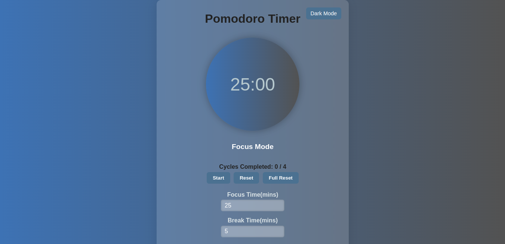
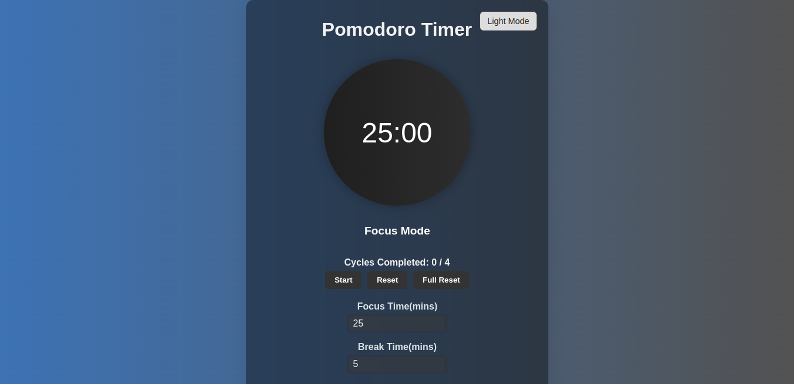

# 🕒 Pomodoro Clock

A simple yet powerful Pomodoro Timer app built using **React.js**. It helps you stay focused and productive by breaking your work into intervals (focus sessions) separated by short and long breaks.

---

## 🚀 Live Demo

🔗 https://pomodoro-app-lovat.vercel.app/

## 📸 Screenshots

  
*Main Timer Display*

*Theme Switcher & Settings Panel*

---

## 🎯 Features

✅ Start, Stop, Reset timer  
✅ Custom focus, break, and long break durations  
✅ Cycle tracking (e.g. 4 focus sessions → long break)  
✅ Automatic switch between work and break sessions  
✅ Mode indicator ("Focus Mode", "Break Time", etc.)  
✅ Sound alert on session change  
✅ Fully responsive for mobile and desktop  
✅ Custom theme support (Light, Dark, Special)

---

## 🔧 Tech Stack

- ⚛️ React.js  
- 🎨 CSS Modules  
- 📦 Vite / Create React App (whichever you used)  
- 🌐 Vercel for deployment (coming soon)

---

## 📂 Folder Structure

pomodoro-app/ ├── public/ │ └── index.html ├── src/ │ ├── components/ │ │ ├── TimerDisplay.jsx │ │ └── Controls.jsx │ ├── App.jsx │ └── index.js ├── screenshots/ │ ├── focus-mode.png │ ├── break-mode.png ├── README.md ├── package.json └── .gitignore

## 🚀 Getting Started

1. **Clone the repository**
   git clone https://github.com/your-username/pomodoro-app.git
   cd pomodoro-app
2. **Install dependencies**
   npm install

3. **Start the app**
   npm start

🌐 Deployment
Deployed on Vercel.
🔗 Live Demo https://pomodoro-app-lovat.vercel.app/

📄 License
This project is licensed under the MIT License.

👩‍💻 Author
Jahnvi Chauhan

Happy Coding!
